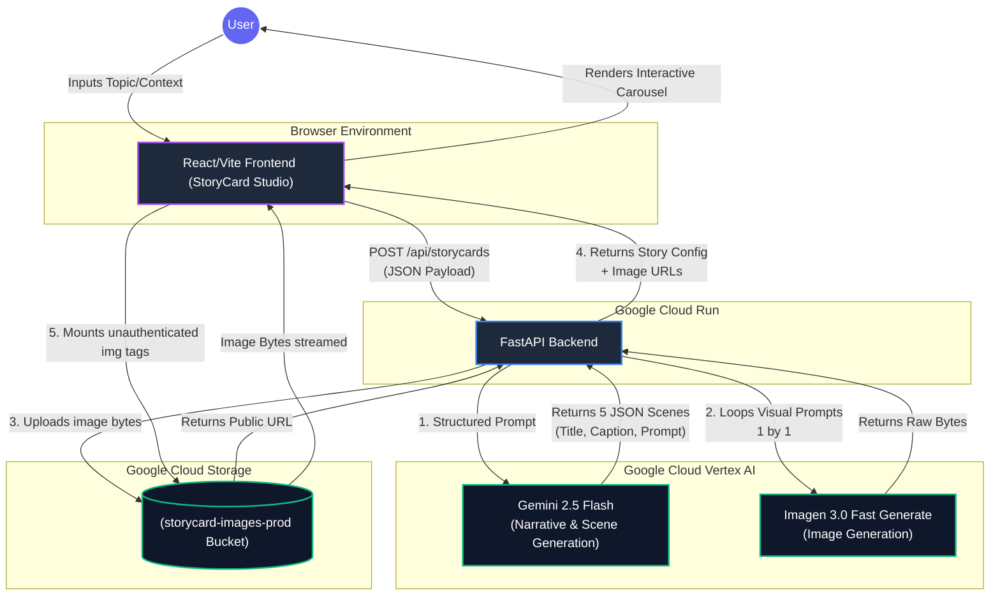

# StoryCard Studio - Architecture

The architecture of StoryCard Studio is built around Google Cloud capabilities, combining the latest Google Gemini models with the fast generation capabilities of Imagen to orchestrate an end-to-end interactive story creation system.

## System Workflow Diagram

## Architecture Flow Description
1. **User Input:** A user opens the React frontend hosted at `https://storycard-web-94946682403.us-central1.run.app` and enters a prompt.
2. **Server Request:** The browser sends a POST request with the user's idea to the FastAPI backend running at `https://storycard-api-94946682403.us-central1.run.app`.
3. **Narrative Generation:** The backend engages **Gemini 2.5 Flash** using Vertex AI, leveraging 'Structured Outputs' via Pydantic classes to generate exactly 5 distinct conceptual cards containing localized image generation prompts for character consistency.
4. **Image Synthesis:** The backend loops through the outputted structures, and pings the model API for **Imagen 3.0 Flash/Fast-generate** models sequentially with a slight pacing delay to safely conform to burst quota boundaries. 
5. **Asset Storage:** The generated image raw bytes are piped directly to a publicly-readable **Google Cloud Storage (GCS)** bucket where they are saved using `UUID` segregation patterns.
6. **Delivery:** The API returns the completed metadata alongside the GCS web-hosted image URLs, which the frontend mounts dynamically into a beautiful Framer Motion-based card carousel.
